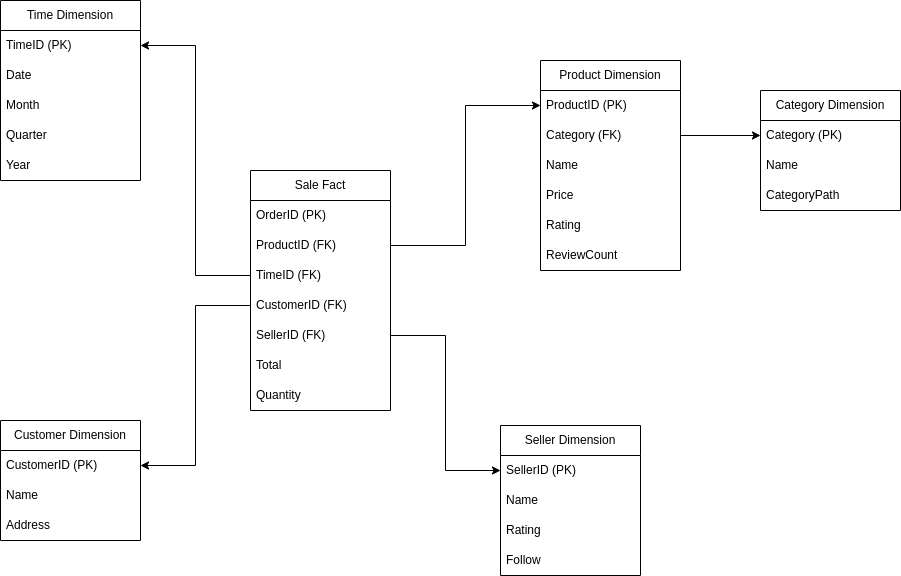

# Tiki-Data-to-Warehouse

Chạy câu lệnh sau để tải về các thư viện cần thiết cho project

```bash
pip install -r requirements.txt
```

## 1. Crawl data

### 1.1. Lấy toàn bộ ID của các category gốc

Sử dụng API của Tiki để lấy thông tin của các category gốc của trang chính trong Tiki, các thông tin sẽ lấy bao gồm ID và tên của category đó

```
https://api.tiki.vn/raiden/v2/menu-config?platform=desktop
```

Thực hiện chạy file `getRootCategory.py` để thực hiện lấy thông tin về các category gốc là lưu vào file `root-category.json`

```bash
python getRootCategory.py
```

### 1.2. Lấy toàn bộ thông tin của các sản phẩm 

Đối với việc lấy thông tin của các sản phẩm, ta sẽ sử dụng các API của Tiki như sau:

- Ứng với mỗi category gốc, ta sẽ sử dụng API phía dưới để thực hiện lấy dữ liệu của các các category nhỏ hơn ở phía trong cho đến mức category cuối cùng, thực hiện tạo thư mục trong thư mục `data-v2` (`data` là 1 phiên bản cũ sẽ được giải thích sau) cho đúng với cấu trúc của category ấy. (Ở phiên bản hiện tại thì project chỉ đang lấy toàn bộ dữ liệu trong category "Nhà sách Tiki")

    ```
    https://tiki.vn/api/v2/categories?parent_id={}
    ```

- Sau khi đã đi đến được category ở mức cuối cùng, ứng với mỗi category ở mức cuối ấy thì ta thực hiện dùng API:
    ```
    https://tiki.vn/api/v2/products
    ```
    với các tham số:
    ```
    - limit=x quy định số sản phẩm tối đa lấy được ở mỗi lần request

    - category=x xác định sẽ lấy những sản phẩm của category nào

    - page=x mỗi category chỉ lấy tối đa được 2000 sản phẩm, tham số page sẽ quy định request đó lấy những sản phẩm ở trang thứ mấy

    - price=x,y là tham số filter cho cho các sản phẩm có giá từ x đến y, sử dụng tham số này cho các trường hợp category nào đó có số lượng sản phẩm lớn hơn 2000
    ```
    response của API trên sẽ là thông tin của các sản phẩm và một số thông tin khác của page tương ứng. Do thời gian thực hiện khá lâu (đã sử dụng concurrent.futures.ThreadPoolExecutor), do đó sau khi đã lấy được thông tin của các sản phẩm thì ta cần 1 bước staging dữ liệu lại vào các file text trong các thư mục tương ứng đã tạo trước đó.


Thực hiện chạy file `getDetailInfo-v2.py` để thực hiện lấy thông tin về các category gốc là lưu vào các thư mục tương ứng của các category trong thư mục `data-v2`

```bash
python getDetailInfo-v2.py
```

Ngoài ra, ở một phiên bản cũ thì có sử dụng thêm API
```
https://tiki.vn/api/v2/products/{}
```
để lấy được thông tin chi tiết nhiều hơn của từng sản phẩm nhưng do sản phẩm quá nhiều và khó khăn về mặt request các API của Tiki khi sử dụng nhiều thread. 

## 2. Thiết kế Data Warehouse

Ở Project này, ta sẽ sử dụng MySQL để xây dựng Data Warehouse. Do MySQL là một RDBMS, do đó để xây dựng dimensional model ta sẽ sử dụng star schema hoặc snowflake schema. Ở project này, ta sẽ xây dựng một Data Warehouse tổng quát (mặc dù chỉ có dữ liệu về Product và Category) để có thể dễ dàng mở rộng nhu cầu phân tích dữ liệu sau này, ta có thiết kế theo Snowflake Schema như hình dưới.



File `createWarehouse.sql` chứa các câu lệnh tạo bảng cho thiết kế trên.

## 3. Đẩy dữ liệu vào Data Warehouse

Trong thư mục `ETL` chứa 2 file để thực hiện việc đưa dữ liệu và Data Warehouse

### 3.1. Lấy dữ liệu tạo thành dạng bảng

Chạy file `ExtractTransform.py` để thực hiện lấy các dữ liệu của tất cả product thực hiện lưu trữ vào 1 file CSV.

```
python ./ETL/ExtractTransform.py
```

### 3.2. Đưa dữ liệu vào Data Warehouse

Chạy file `load2DW.py` để thực hiện lấy các dữ liệu của tất cả product thực hiện lưu trữ vào 1 file CSV.

```
python ./ETL/load2DW.py
```